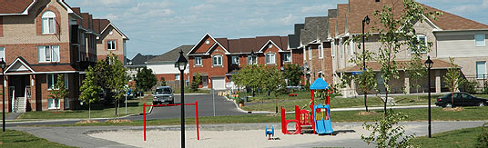

Prototype.Wipes
===============

Mirrored from http://preview.moveable.com/jm/jameslab/Wipe/


__Overview__

Wipes is an add-on method for the Effect namespace in the [Script.aculo.us](http://script.aculo.us/downloads) library.

include `wipe.js` on your page after prototype.js and scriptaculous.js.

```html
<script src="prototype.js" type="text/javascript" charset="utf-8"></script>
<script src="scriptaculous.js" type="text/javascript" charset="utf-8"></script>
<script src="wipe.js" type="text/javascript" charset="utf-8"></script>
```

__Example__

```html
<div id="content"></div>
```


```javascript
new Effect.Wipe('content',{'newImg':'Wipe3.jpg',duration:2,mode:'vSplit'}) 
```
